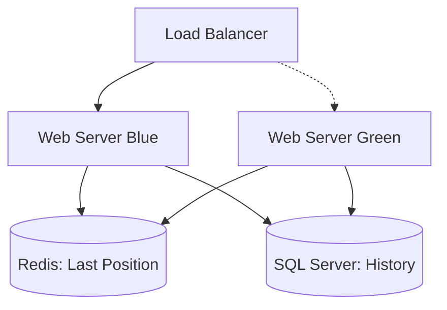

- **Decisión:** Implementar Redis como caché de estado actual y Blue-Green Deployment para actualizaciones.

- **Justificación:** Minimizar el impacto en SQL Server y garantizar disponibilidad del 99.9% durante despliegues.

- **Diagrama de Infraestructura (Mermaid):**

